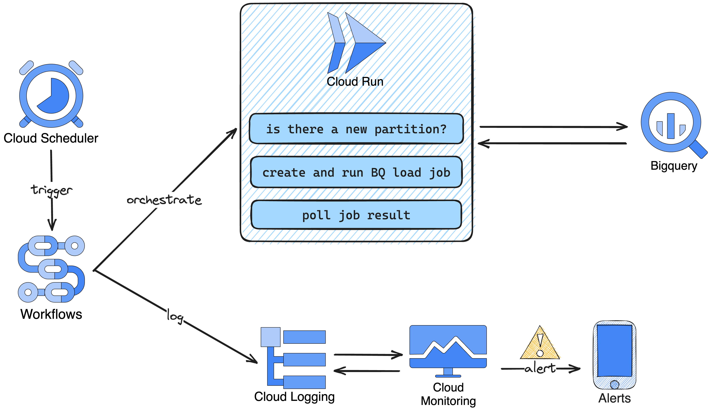

# GCP Batch Load Hive Partitioned data from GSC to BigQuery

Ingest hourly hive partitioned data from GCS to BigQuery.

Note: it ingests tab delimited CSVs by default, using the configuration under `ingestion/bigquery_interaction.py:17`.
But, the workflow can be extended to allow passing a generic config. The API already accepts it.
See: `ingestion.app.NewLoadJob`

## Architecture


These pipeline is comprised from the following pieces:

1. GCP Cloud Scheduler
2. GCP Workflows
3. GCP Cloud Run
4. GCP Cloud Logging
5. GCP Cloud Monitoring
6. GCP Cloud Storage
7. GCP BigQuery

It flows in the following order:

1. The scheduler runs every hour.
2. It triggers the workflow, who orchestrates HTTP calls to our cloud run service.
3. The cloud run service in turn talks to BigQuery to create, run and poll ingestion job status, returning the ingestion
   status resul to
   workflows.
4. The ingestion is done to a landing table receing the raw records as is.
5. Once ingestion job status is returned, workflows logs it to cloud logging, allowing us to monitor.

### Data pipeline best practices

#### Idempotency

The pipeline is idempotent, ie, we can run it one or more time for the same partition, and the BigQuery landing table
will have the same state.

We achieve this by overriding the partition at every run.

#### Late records

Ingestion is scheduled to "every hour" and 40 minutes.
We can schedule to run on the first minute of the new hour.
However, the service uploading records from the edge to the cloud might send late records.
For example, it might upload a record to the `hour=09` at 10:15.
Hence, we wait a 40 min to minimize the risk of missing late records.

#### Backfilling

Data can be backfilled to BigQuery, in case we need it.

Currently, the process is manual, partition by partition. See [TODOs](#todos-) for other to-be-implemented features.

To backfill, manually trigger the workflow adding the partition parameter. For example:

```shell
# for year=2023, month=08, day=06, hour=12
./commands.sh gcp:workflow:run:partition "2023080612"
```

#### Monitoring

Monitor #2 checks for infra problems, while #1 checks for BigQuery problems.

1 - Ingestion - BigQuery Job Failed
Conditions: Policy violates when ANY condition is met.
Log Query:

```text
(
   resource.type="workflows.googleapis.com/Workflow" 
   resource.labels.workflow_id="bigquery-ingestion-per-hour-partition-workflow" 
   resource.labels.location="us-central1"
) 
(
    jsonPayload.success.result =~ ".*status.*FAIL.*"
)
```

2 - Ingestion - GCP Workflow Failed
Conditions: Policy violates when ANY condition is met
Log Query:

```text
(
    resource.type="workflows.googleapis.com/Workflow" 
    resource.labels.workflow_id="bigquery-ingestion-per-hour-partition-workflow" 
    resource.labels.location="us-central1"
) 
(
    severity=ERROR
)
```

### Cloud costs summary

The costs to ingest should be near zero.

1. [Scheduler](https://cloud.google.com/scheduler/pricing) costs will cost around $0.10/month.
2. [Workflow](https://cloud.google.com/workflows/pricing) costs will be zero or near zero, since 24 runs a day (720
   runs a month) is under the free tier usage.
3. [Cloud Run](https://cloud.google.com/run/pricing) costs will be zero or near zero, because we should again be within
   the free tier.
4. [Monitoring](https://cloud.google.com/stackdriver/pricing) might cost something, still hard to estimate. But usage is
   really low.
5. [BigQuery](https://cloud.google.com/bigquery/pricing) ingestion will be free, since we are using batch load with the
   shared slot pool. Storage will be the main costs, which we should monitor and apply automatic tail pruning (
   see [TODOs](#todos-)).

## Develop

### Setting up local env

**Must have:**

1. [Poetry](https://python-poetry.org/) (using version 1.4.0)
2. Python >= 3.11 (best set with Pyenv, since local python version will be inferred
   from `[.python-version](.python-version)`)

**Optional:**

1. Docker - if you want to test image build
2. Google cloud CLI - if you want to test deployment
3. Google cloud local authentication - if you want to connect to BigQuery from your local machine

### Deployment commands

Currently, all deployment commands are under `./commands.sh <COMMAND>`.
For example, `./commands.sh gcp:bigquery:create_landing_table` will create a new table if it not exists.
Please see the `./commands.sh` script for other deployment methods.

_Note:_ all commands deploy on prod currently. See [TODOs](#todos-) for other to-be-implemented features.

# TODOs:

- update deploying (using gitlab-ci, either with terraform or chaining `./commands.sh <COMMAND>`)
- deploy on different envs depending on branch
- automate backfilling (currently easily done manually)
- apply auto pruning to bigquery landing table + probably reduce time travel and fail-safe, since we can easly backfill
- monitor storage costs